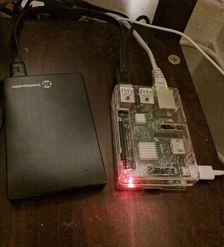

# Raspberry Pi File Server Walkthrough

## Contents
[The Initial Setup](#the-initial-setup) | [Install Required Software](#install-required-software) | [Setup File Shares](#setup-file-shares) | Access File Share from Client Devices



A Raspberry Pi 2 running Raspbian, based on Debian 8 "Jessie". It is attached to a standard 2.5 inch HDD and a 3.5 inch HDD (not shown). For maximum throughput, it is connected via ethernet to the local network.

## The Initial Setup

This guide has been developed and tested on a Raspberry Pi 2 running Raspbian, based on Debian 8 “Jessie”. The Raspberry Pi Foundation’s website [(link)](https://www.raspberrypi.org/downloads/noobs/) has an easy to setup installer called NOOBS, short for New Out Of the Box Software. For this setup, you will need to connect your Raspberry Pi to a power source (capable of at least 2A, especially for directly connected hard drives), a monitor, mouse and keyboard. Advanced users can proceed using SSH, if setup on their system.

Once you complete this tutorial, you will be able to access files stored on your Raspberry Pi through your smartphone or computer (compatible with Android, iOS, Windows, Linux, macOS).

## Install Required Software

Open the terminal and run the following command to ensure all packages are up to date:

`sudo apt-get update && sudo apt-get dist-upgrade`

Next install the “samba” package:

`sudo apt-get install samba`

Next ensure that a text editor is installed. Gedit is a good one if using a desktop environment, otherwise vim or nano work well in command-line only environments. The relevant commands to install your text editor of choice:

`sudo apt-get install gedit`

`sudo apt-get install vim`

`sudo apt-get install nano`

## Setup File Shares

Depending on the text editor preferred, use one of the following commands to open a configuration file to setup file shares:

`sudo gedit /etc/samba/smb.conf` 
[edits the file in gedit]

`sudo vi /etc/samba/smb.conf` 
[edits the file in vim]

`sudo nano -w /etc/samba/smb.conf` 
[edits the file in nano]

Navigate all the way to the bottom of the file. Ignore, but do not remove the preceding text as it contains useful information for future configurations. Setup your file share with the following parameters, changing the name of the share (instead of [File-share]), comment, path and valid users according to your local setup:

```
[File-share] 
comment = Shared files 
path = /home/pi/shared_folder 
browseable = yes 
writable = yes 
valid users = pi
```

Save changes and close the file. Make sure to change the path to the location of the folder or hard drive you want to share to your local network. The browseable option ensures that the file share can be discovered in the local network without manually entering the IP address of the Raspberry Pi. The valid users line is important for securing your file share so that no one can access your data without knowing your username and password. Use the following command to create a password for your username:

`sudo smbpasswd -a username`

Remember to replace username in the command with the user that is logged in the Raspberry Pi. Finally, use the following commands to reset the samba service so that it recognizes the changes made to your configuration file:

```
sudo systemctl restart smbd 
sudo systemctl restart nmbd
```
